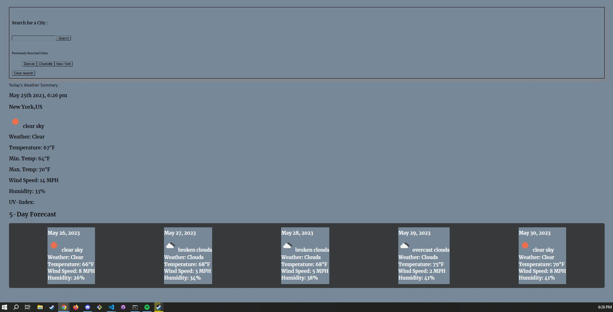

# Weather Dashboard


## Description

I made a webpage in which when the user looks up a location/city then it will give the weather for the day and the following five days. The application works along with showing the previous searches below the search bar. Using the API to be able to get the data that is needed to be able to work the application.

## User Story


## Acceptance Criteria

```
GIVEN a weather dashboard with form inputs
WHEN I search for a city
THEN I am presented with current and future conditions for that city and that city is added to the search history
WHEN I view current weather conditions for that city
THEN I am presented with the city name, the date, an icon representation of weather conditions, the temperature, the humidity, and the wind speed
WHEN I view future weather conditions for that city
THEN I am presented with a 5-day forecast that displays the date, an icon representation of weather conditions, the temperature, the wind speed, and the humidity
WHEN I click on a city in the search history
THEN I am again presented with current and future conditions for that city
```

## Picture of Webpage



## Link to Webpage

[Link to Website](https://braymurph.github.io/Weather-Dashboard/)